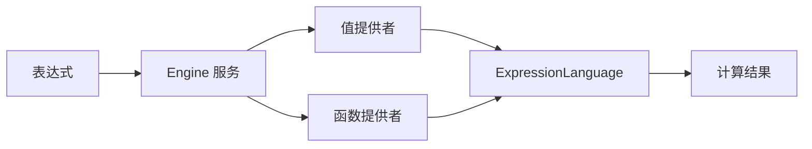

# symfony-ecol-bundle 扩展指南

## 如何实现新的 DSL 函数

本指南详细说明如何在 `symfony-ecol-bundle` 中添加新的 DSL 函数或值。

---

## 目录

- [核心概念](#核心概念)
- [扩展方式](#扩展方式)
  - [方式一：值提供者 (Value Providers)](#方式一值提供者-value-providers)
  - [方式二：函数提供者 (Function Providers)](#方式二函数提供者-function-providers)
- [实现步骤](#实现步骤)
- [测试编写](#测试编写)
- [最佳实践](#最佳实践)
- [常见问题](#常见问题)

---

## 核心概念

`symfony-ecol-bundle` 基于 Symfony ExpressionLanguage 构建，提供了两种扩展机制：

1. **值提供者 (Value Providers)** - 提供表达式中可用的**变量值**，例如 `当天日期`、`当前时间戳` 等
2. **函数提供者 (Function Providers)** - 提供表达式中可调用的**函数**，例如 `date()`、`date_modify()` 等

### 架构流程



### 自动注册机制

Bundle 使用 Symfony 的服务标签系统自动发现和注册扩展：

- 值提供者使用标签：`ecol.value.provider`
- 函数提供者使用标签：`ecol.function.provider`

通过 PHP 属性 `#[AutoconfigureTag]` 可自动添加标签，无需手动配置。

---

## 扩展方式

### 方式一：值提供者 (Value Providers)

值提供者用于在表达式中提供**预定义的变量值**，这些值在表达式评估时自动注入。

#### 何时使用

- 提供系统级常量（当前日期、时间戳等）
- 提供根据上下文计算的动态值
- 提供可在多个表达式中复用的命名值

#### 实现接口

```php
namespace Tourze\EcolBundle\Value;

interface ExpressionValue
{
    /**
     * 判断这个值提供者是否支持当前表达式
     *
     * @param string $expression 表达式字符串
     * @param array<string, mixed> $values 原始值列表
     * @return bool
     */
    public function isSupported(string $expression, array $values): bool;

    /**
     * 返回变量名列表（支持多个别名）
     *
     * @return array<string>
     */
    public function getNames(): array;

    /**
     * 获取实际的值
     *
     * @param array<string, mixed> $values 原始值列表
     * @return mixed
     */
    public function getValue(array $values): mixed;
}
```

#### 实现示例：简单值

```php
<?php

namespace Tourze\EcolBundle\Value;

use Carbon\CarbonImmutable;

/**
 * 提供今天的日期（Ymd 格式）
 */
class Today implements ExpressionValue
{
    /** @param array<string, mixed> $values */
    public function isSupported(string $expression, array $values): bool
    {
        foreach ($this->getNames() as $name) {
            if (str_contains($expression, $name)) {
                return true;
            }
        }

        return false;
    }

    /** @return array<string> */
    public function getNames(): array
    {
        return [
            '当天日期',
            'today',  // 支持多个别名
        ];
    }

    /** @param array<string, mixed> $values */
    public function getValue(array $values): mixed
    {
        return CarbonImmutable::now()->format('Ymd');
    }
}
```

#### 实现示例：复杂值

```php
<?php

namespace Tourze\EcolBundle\Value;

use Carbon\CarbonImmutable;

/**
 * 提供今天的日期范围（开始和结束时间戳）
 */
class TodayRange implements ExpressionValue
{
    /** @param array<string, mixed> $values */
    public function isSupported(string $expression, array $values): bool
    {
        foreach ($this->getNames() as $name) {
            if (str_contains($expression, $name)) {
                return true;
            }
        }

        return false;
    }

    /** @return array<string> */
    public function getNames(): array
    {
        return [
            '当天日期范围',
        ];
    }

    /** @param array<string, mixed> $values */
    public function getValue(array $values): mixed
    {
        $date = CarbonImmutable::now();

        return [
            $date->clone()->startOfDay()->getTimestamp(),
            $date->clone()->endOfDay()->getTimestamp(),
        ];
    }
}
```

#### 使用示例

```php
use Tourze\EcolBundle\Service\Engine;

// 表达式会自动获取 "当天日期" 变量的值
$result = $engine->evaluate('当天日期 == "20231215"');

// 表达式会自动获取 "当天日期范围" 变量的值（数组）
$result = $engine->evaluate('timestamp >= 当天日期范围[0] && timestamp <= 当天日期范围[1]', [
    'timestamp' => time(),
]);
```

---

### 方式二：函数提供者 (Function Providers)

函数提供者用于在表达式中提供**可调用的函数**。

#### 何时使用

- 需要在表达式中执行复杂运算
- 需要接受参数并返回计算结果
- 需要实现业务逻辑函数

#### 实现接口

函数提供者实现 Symfony 的标准接口：

```php
namespace Symfony\Component\ExpressionLanguage;

interface ExpressionFunctionProviderInterface
{
    /**
     * @return ExpressionFunction[]
     */
    public function getFunctions(): array;
}
```

#### ExpressionFunction 构造

每个 `ExpressionFunction` 需要三个参数：

1. **函数名称** - 在表达式中调用的名称
2. **编译器回调** - 用于编译表达式为 PHP 代码（通常返回代码字符串）
3. **评估器回调** - 用于实际执行函数逻辑

```php
new ExpressionFunction(
    'function_name',           // 函数名称
    function (...$args) {      // 编译器回调
        // 返回 PHP 代码字符串
        return sprintf('function_name(%s)', implode(', ', $args));
    },
    function ($values, ...$args) {  // 评估器回调
        // 实际执行逻辑
        return result;
    }
)
```

#### 实现示例：日期函数

```php
<?php

namespace Tourze\EcolBundle\Functions;

use Symfony\Component\DependencyInjection\Attribute\AutoconfigureTag;
use Symfony\Component\ExpressionLanguage\ExpressionFunction;
use Symfony\Component\ExpressionLanguage\ExpressionFunctionProviderInterface;
use Tourze\EcolBundle\Exception\DateModifyException;

/**
 * 日期相关函数提供者
 */
#[AutoconfigureTag(name: 'ecol.function.provider')]
class DateFunctionProvider implements ExpressionFunctionProviderInterface
{
    public function getFunctions(): array
    {
        return [
            // date() 函数 - 创建日期对象
            new ExpressionFunction(
                'date',
                fn ($date) => sprintf('(new \DateTime(%s))', $this->formatDateParam($date)),
                function (array $values, $date): \DateTime {
                    return new \DateTime($this->formatDateParam($date));
                }
            ),

            // date_modify() 函数 - 修改日期
            new ExpressionFunction(
                'date_modify',
                fn ($date, $modify) => sprintf(
                    '%s->modify(%s)',
                    $this->formatDateParam($date),
                    $this->formatModifyParam($modify)
                ),
                function (array $values, $date, $modify): \DateTime|bool {
                    if (!$date instanceof \DateTime) {
                        throw new DateModifyException('date_modify() expects parameter 1 to be a Date');
                    }

                    return $date->modify($this->formatModifyParam($modify));
                }
            ),
        ];
    }

    private function formatDateParam(mixed $date): string
    {
        return is_string($date) ? $date : (is_scalar($date) ? strval($date) : 'now');
    }

    private function formatModifyParam(mixed $modify): string
    {
        return is_string($modify) ? $modify : (is_scalar($modify) ? strval($modify) : '');
    }
}
```

#### 实现示例：数学函数

```php
<?php

namespace Tourze\EcolBundle\Functions;

use Symfony\Component\DependencyInjection\Attribute\AutoconfigureTag;
use Symfony\Component\ExpressionLanguage\ExpressionFunction;
use Symfony\Component\ExpressionLanguage\ExpressionFunctionProviderInterface;

/**
 * 数学相关函数提供者
 */
#[AutoconfigureTag(name: 'ecol.function.provider')]
class MathFunctionProvider implements ExpressionFunctionProviderInterface
{
    public function getFunctions(): array
    {
        return [
            // 取绝对值
            new ExpressionFunction(
                '取绝对值',
                fn ($number) => sprintf('取绝对值(%s)', $this->formatNumber($number)),
                function (array $values, $number): float|int {
                    return abs($this->toNumeric($number));
                }
            ),

            // 取负数
            new ExpressionFunction(
                '取负数',
                fn ($number) => sprintf('取负数(%s)', $this->formatNumber($number)),
                function (array $values, $number): float|int {
                    return -abs($this->toNumeric($number));
                }
            ),

            // 加法
            new ExpressionFunction(
                '加上',
                fn ($number1, $number2) => sprintf(
                    '加上(%s, %s)',
                    $this->formatNumber($number1),
                    $this->formatNumber($number2)
                ),
                function (array $values, $number1, $number2): float {
                    return $this->toFloat($number1) + $this->toFloat($number2);
                }
            ),
        ];
    }

    private function formatNumber(mixed $number): string
    {
        return is_numeric($number) ? strval($number) : '0';
    }

    private function toNumeric(mixed $number): float|int
    {
        if (!is_numeric($number)) {
            return 0;
        }
        return is_float($number) ? $number : (is_int($number) ? $number : floatval($number));
    }

    private function toFloat(mixed $number): float
    {
        return is_numeric($number) ? floatval($number) : 0.0;
    }
}
```

#### 使用示例

```php
use Tourze\EcolBundle\Service\Engine;

// 使用日期函数
$result = $engine->evaluate('date("2023-12-15")->format("Y-m-d")');
// 返回: "2023-12-15"

$result = $engine->evaluate('date_modify(date("2023-12-15"), "+1 day")->format("Y-m-d")');
// 返回: "2023-12-16"

// 使用数学函数
$result = $engine->evaluate('取绝对值(-100)');
// 返回: 100

$result = $engine->evaluate('加上(10, 20)');
// 返回: 30
```

---

## 实现步骤

### 步骤 1: 选择扩展方式

根据需求选择：

- **提供变量值** → 实现值提供者 (Value Provider)
- **提供可调用函数** → 实现函数提供者 (Function Provider)

### 步骤 2: 创建类文件

#### 值提供者

在 Bundle 内部创建：

```
packages/symfony-ecol-bundle/src/Value/YourValue.php
```

在应用内部创建：

```
src/Expression/Value/YourValue.php
```

#### 函数提供者

在 Bundle 内部创建：

```
packages/symfony-ecol-bundle/src/Functions/YourFunctionProvider.php
```

在应用内部创建：

```
src/Expression/Functions/YourFunctionProvider.php
```

### 步骤 3: 实现接口

#### 值提供者

```php
<?php

namespace App\Expression\Value;  // 或 Tourze\EcolBundle\Value

use Symfony\Component\DependencyInjection\Attribute\AutoconfigureTag;
use Tourze\EcolBundle\Value\ExpressionValue;

#[AutoconfigureTag(name: 'ecol.value.provider')]
class YourValue implements ExpressionValue
{
    public function isSupported(string $expression, array $values): bool
    {
        foreach ($this->getNames() as $name) {
            if (str_contains($expression, $name)) {
                return true;
            }
        }
        return false;
    }

    public function getNames(): array
    {
        return ['your_variable_name'];
    }

    public function getValue(array $values): mixed
    {
        // 返回实际的值
        return 'your_value';
    }
}
```

#### 函数提供者

```php
<?php

namespace App\Expression\Functions;  // 或 Tourze\EcolBundle\Functions

use Symfony\Component\DependencyInjection\Attribute\AutoconfigureTag;
use Symfony\Component\ExpressionLanguage\ExpressionFunction;
use Symfony\Component\ExpressionLanguage\ExpressionFunctionProviderInterface;

#[AutoconfigureTag(name: 'ecol.function.provider')]
class YourFunctionProvider implements ExpressionFunctionProviderInterface
{
    public function getFunctions(): array
    {
        return [
            new ExpressionFunction(
                'your_function',
                fn ($arg) => sprintf('your_function(%s)', $arg),
                function (array $values, $arg): mixed {
                    // 实现函数逻辑
                    return $arg * 2;
                }
            ),
        ];
    }
}
```

### 步骤 4: 配置服务（如果在应用内部）

如果在应用代码中创建，需要在 `config/services.yaml` 中配置：

```yaml
services:
    # 值提供者
    App\Expression\Value\YourValue:
        tags: ['ecol.value.provider']

    # 函数提供者
    App\Expression\Functions\YourFunctionProvider:
        tags: ['ecol.function.provider']
```

**注意**：如果使用了 `#[AutoconfigureTag]` 属性，并且启用了 `autoconfigure: true`，则无需手动添加标签。

### 步骤 5: 清除缓存

```bash
php bin/console cache:clear
```

---

## 测试编写

### 值提供者测试

```php
<?php

namespace Tourze\EcolBundle\Tests\Value;

use PHPUnit\Framework\Attributes\CoversClass;
use PHPUnit\Framework\TestCase;
use Tourze\EcolBundle\Value\YourValue;

#[CoversClass(YourValue::class)]
final class YourValueTest extends TestCase
{
    private YourValue $value;

    protected function setUp(): void
    {
        parent::setUp();
        $this->value = new YourValue();
    }

    public function testIsSupportedShouldReturnTrueForMatchingExpression(): void
    {
        $result = $this->value->isSupported('your_variable_name > 0', []);
        $this->assertTrue($result);
    }

    public function testIsSupportedShouldReturnFalseForNonMatchingExpression(): void
    {
        $result = $this->value->isSupported('other_expression', []);
        $this->assertFalse($result);
    }

    public function testGetNamesShouldReturnExpectedNames(): void
    {
        $names = $this->value->getNames();
        $this->assertContains('your_variable_name', $names);
    }

    public function testGetValueShouldReturnExpectedValue(): void
    {
        $value = $this->value->getValue([]);
        $this->assertEquals('expected_value', $value);
    }
}
```

### 函数提供者测试

```php
<?php

namespace Tourze\EcolBundle\Tests\Functions;

use PHPUnit\Framework\Attributes\CoversClass;
use Symfony\Component\ExpressionLanguage\ExpressionFunction;
use Symfony\Component\ExpressionLanguage\ExpressionLanguage;
use Tourze\EcolBundle\Functions\YourFunctionProvider;
use Tourze\PHPUnitSymfonyKernelTest\AbstractIntegrationTestCase;

#[CoversClass(YourFunctionProvider::class)]
final class YourFunctionProviderTest extends AbstractIntegrationTestCase
{
    private YourFunctionProvider $provider;
    private ExpressionLanguage $expressionLanguage;

    protected function onSetUp(): void
    {
        $this->provider = self::getService(YourFunctionProvider::class);
        $this->expressionLanguage = new ExpressionLanguage();
        $this->expressionLanguage->registerProvider($this->provider);
    }

    public function testGetFunctionsShouldReturnExpressionFunctionArray(): void
    {
        $functions = $this->provider->getFunctions();
        $this->assertNotEmpty($functions);

        foreach ($functions as $function) {
            $this->assertInstanceOf(ExpressionFunction::class, $function);
        }

        $functionNames = array_map(fn ($func) => $func->getName(), $functions);
        $this->assertContains('your_function', $functionNames);
    }

    public function testYourFunctionShouldWorkCorrectly(): void
    {
        $result = $this->expressionLanguage->evaluate('your_function(10)');
        $this->assertEquals(20, $result);
    }
}
```

---

## 最佳实践

### 1. 命名规范

- **值提供者类名**：使用描述性名称，如 `Today`, `CurrentTimestamp`
- **函数提供者类名**：使用 `*FunctionProvider` 后缀，如 `DateFunctionProvider`
- **变量名**：使用清晰的中文或英文，如 `当天日期`、`current_timestamp`
- **函数名**：使用动词短语，如 `date()`, `date_modify()`, `取绝对值()`

### 2. 性能优化

#### 值提供者 - 延迟计算

只在表达式中实际使用时才计算值：

```php
public function isSupported(string $expression, array $values): bool
{
    // 快速检查表达式是否包含变量名
    foreach ($this->getNames() as $name) {
        if (str_contains($expression, $name)) {
            return true;
        }
    }
    return false;
}
```

#### 函数提供者 - 参数验证

在评估器回调中进行严格的参数验证：

```php
function (array $values, $date, $modify): \DateTime|bool {
    if (!$date instanceof \DateTime) {
        throw new DateModifyException('date_modify() expects parameter 1 to be a Date');
    }
    // ...
}
```

### 3. 类型安全

使用 PHP 类型声明和 PHPStan 注解：

```php
/**
 * @param array<string, mixed> $values
 * @return array<string>
 */
public function getNames(): array
{
    return ['variable_name'];
}
```

### 4. 支持多个别名

值提供者可以返回多个变量名，支持中英文：

```php
public function getNames(): array
{
    return [
        '当天日期',
        'today',
        'current_date',
    ];
}
```

### 5. 异常处理

定义清晰的异常类型：

```php
namespace Tourze\EcolBundle\Exception;

class DateModifyException extends \RuntimeException
{
}
```

在函数中抛出有意义的异常：

```php
if (!$date instanceof \DateTime) {
    throw new DateModifyException('date_modify() expects parameter 1 to be a Date');
}
```

### 6. 文档注释

为每个类和方法添加清晰的文档注释：

```php
/**
 * 提供今天的日期范围（开始和结束时间戳）
 *
 * 使用示例:
 * - timestamp >= 当天日期范围[0] && timestamp <= 当天日期范围[1]
 */
class TodayRange implements ExpressionValue
{
    // ...
}
```

### 7. 依赖注入

函数提供者可以注入服务：

```php
#[AutoconfigureTag(name: 'ecol.function.provider')]
class ServiceAwareFunctionProvider implements ExpressionFunctionProviderInterface
{
    public function __construct(
        private readonly SomeService $service
    ) {
    }

    public function getFunctions(): array
    {
        return [
            new ExpressionFunction(
                'use_service',
                fn ($arg) => sprintf('use_service(%s)', $arg),
                function (array $values, $arg): mixed {
                    return $this->service->process($arg);
                }
            ),
        ];
    }
}
```

### 8. 不可变性

值提供者应该是无状态的，避免在 `getValue()` 中修改内部状态。

---

## 常见问题

### Q1: 值提供者和函数提供者有什么区别？

**值提供者**：
- 提供**预定义的变量**
- 在表达式评估前自动注入
- 适合系统级常量和上下文相关的值
- 示例：`当天日期`、`当前时间戳`

**函数提供者**：
- 提供**可调用的函数**
- 需要在表达式中显式调用
- 适合需要参数的复杂运算
- 示例：`date("2023-12-15")`、`取绝对值(-100)`

### Q2: 如何在应用代码中添加自定义扩展？

在应用的 `src/Expression/` 目录下创建类，并在 `config/services.yaml` 中配置：

```yaml
services:
    App\Expression\Value\:
        resource: '../src/Expression/Value/'
        tags: ['ecol.value.provider']

    App\Expression\Functions\:
        resource: '../src/Expression/Functions/'
        tags: ['ecol.function.provider']
```

或者使用 `#[AutoconfigureTag]` 属性自动标记。

### Q3: 如何调试我的扩展是否被正确注册？

使用 Symfony 命令查看服务：

```bash
# 查看所有值提供者
php bin/console debug:container --tag=ecol.value.provider

# 查看所有函数提供者
php bin/console debug:container --tag=ecol.function.provider
```

### Q4: 值提供者的 `isSupported()` 什么时候返回 true？

当表达式字符串中包含你定义的变量名时。使用 `str_contains()` 进行快速检查：

```php
public function isSupported(string $expression, array $values): bool
{
    foreach ($this->getNames() as $name) {
        if (str_contains($expression, $name)) {
            return true;
        }
    }
    return false;
}
```

### Q5: 函数提供者的两个回调分别什么时候使用？

- **编译器回调** (第2个参数)：用于将表达式编译为 PHP 代码（缓存）
- **评估器回调** (第3个参数)：用于实际执行函数逻辑（运行时）

大多数情况下，编译器回调返回简单的函数调用字符串即可：

```php
fn ($arg) => sprintf('function_name(%s)', $arg)
```

### Q6: 如何访问表达式的上下文变量？

在值提供者的 `getValue()` 和函数提供者的评估器回调中，都可以访问 `$values` 参数：

```php
public function getValue(array $values): mixed
{
    // 访问上下文中的 user_id
    $userId = $values['user_id'] ?? null;

    // 基于上下文返回不同的值
    return $userId ? "user_{$userId}_data" : "default_data";
}
```

### Q7: 能否在函数中访问 Symfony 服务？

可以，通过构造函数注入：

```php
#[AutoconfigureTag(name: 'ecol.function.provider')]
class DatabaseFunctionProvider implements ExpressionFunctionProviderInterface
{
    public function __construct(
        private readonly EntityManagerInterface $entityManager
    ) {
    }

    public function getFunctions(): array
    {
        return [
            new ExpressionFunction(
                'find_user',
                fn ($id) => sprintf('find_user(%s)', $id),
                function (array $values, $id): ?User {
                    return $this->entityManager->find(User::class, $id);
                }
            ),
        ];
    }
}
```

### Q8: 如何支持中文函数名？

直接在函数名中使用中文：

```php
new ExpressionFunction(
    '取绝对值',  // 中文函数名
    fn ($number) => sprintf('取绝对值(%s)', $number),
    function (array $values, $number): float|int {
        return abs($number);
    }
)
```

---

## 参考资源

### 核心文件

- `src/Service/Engine.php` - 表达式引擎核心
- `src/Value/ExpressionValue.php` - 值提供者接口
- `src/Functions/DateFunctionProvider.php` - 函数提供者示例
- `src/Resources/config/services.yaml` - 服务配置

### 示例实现

- `src/Value/Today.php` - 简单值提供者
- `src/Value/TodayRange.php` - 复杂值提供者（返回数组）
- `src/Functions/MathFunctionProvider.php` - 数学函数示例
- `src/Functions/ServiceFunctionProvider.php` - 服务访问函数示例

### 测试示例

- `tests/Value/TodayRangeTest.php` - 值提供者测试
- `tests/Functions/DateFunctionProviderTest.php` - 函数提供者测试

### 官方文档

- [Symfony ExpressionLanguage](https://symfony.com/doc/current/components/expression_language.html)
- [Symfony Service Tags](https://symfony.com/doc/current/service_container/tags.html)

---

## 总结

扩展 `symfony-ecol-bundle` 的 DSL 功能非常简单：

1. **选择扩展方式** - 值提供者或函数提供者
2. **实现对应接口** - `ExpressionValue` 或 `ExpressionFunctionProviderInterface`
3. **添加自动配置标签** - `#[AutoconfigureTag]`
4. **编写测试** - 确保功能正确
5. **清除缓存** - 让 Symfony 识别新服务

遵循本指南和最佳实践，你可以轻松扩展表达式语言的能力，满足各种业务需求。
