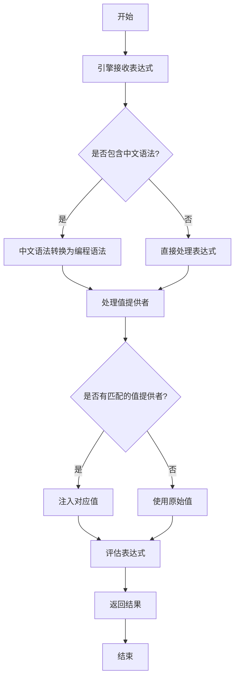
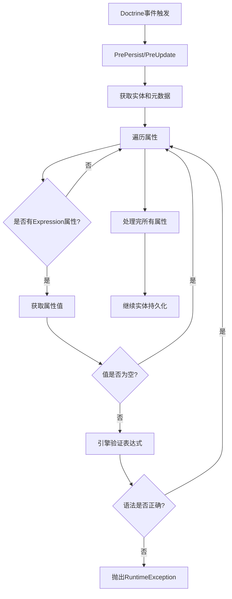
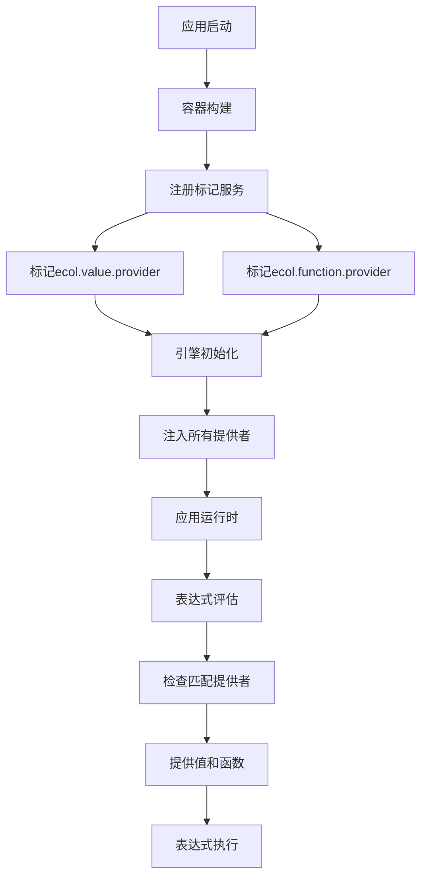
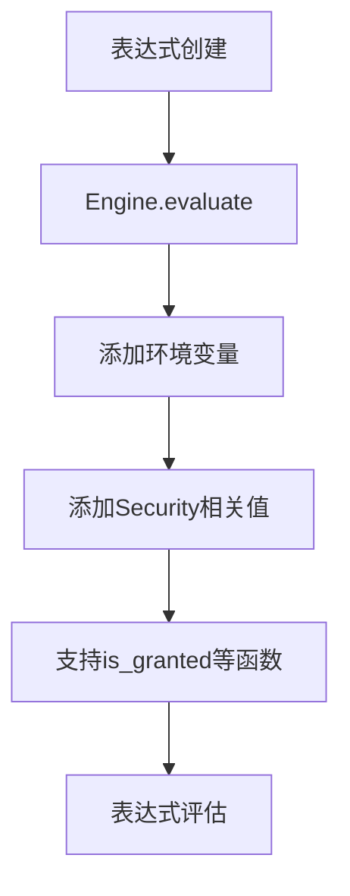
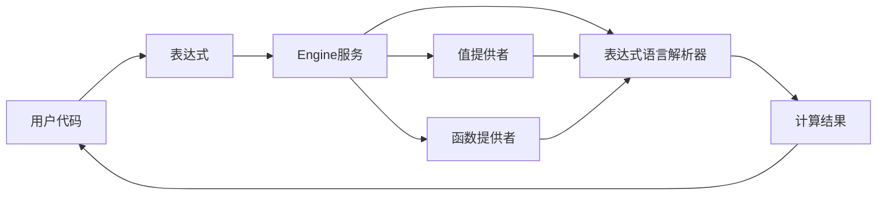

# symfony-ecol-bundle 工作流程

本文档说明了 symfony-ecol-bundle 中表达式的评估和验证流程。

## 表达式评估流程

```mermaid
flowchart TD
    A[开始] --> B[引擎接收表达式]
    B --> C{是否包含中文语法?}
    C -->|是| D[中文语法转换为编程语法]
    C -->|否| E[直接处理表达式]
    D --> F[处理值提供者]
    E --> F
    F --> G{是否有匹配的值提供者?}
    G -->|是| H[注入对应值]
    G -->|否| I[使用原始值]
    H --> J[评估表达式]
    I --> J
    J --> K[返回结果]
    K --> L[结束]
```

## 实体表达式验证流程

```mermaid
flowchart TD
    A[Doctrine事件触发] --> B[PrePersist/PreUpdate]
    B --> C[获取实体和元数据]
    C --> D[遍历属性]
    D --> E{是否有Expression属性?}
    E -->|否| D
    E -->|是| F[获取属性值]
    F --> G{值是否为空?}
    G -->|是| D
    G -->|否| H[引擎验证表达式]
    H --> I{语法是否正确?}
    I -->|是| D
    I -->|否| J[抛出RuntimeException]
    D --> K[处理完所有属性]
    K --> L[继续实体持久化]
```

## 值提供者注册和使用流程

```mermaid
flowchart TD
    A[应用启动] --> B[容器构建]
    B --> C[注册标记服务]
    C --> D[标记ecol.value.provider]
    C --> E[标记ecol.function.provider]
    D --> F[引擎初始化]
    E --> F
    F --> G[注入所有提供者]
    G --> H[应用运行时]
    H --> I[表达式评估]
    I --> J[检查匹配提供者]
    J --> K[提供值和函数]
    K --> L[表达式执行]
```

## 与Symfony安全系统集成

```mermaid
flowchart TD
    A[表达式创建] --> B[Engine.evaluate]
    B --> C[添加环境变量]
    C --> D[添加Security相关值]
    D --> E[支持is_granted等函数]
    E --> F[表达式评估]
```

## 数据流图

```mermaid
flowchart LR
    A[用户代码] --> B[表达式]
    B --> C[Engine服务]
    C --> D[值提供者]
    C --> E[函数提供者]
    C --> F[表达式语言解析器]
    D --> F
    E --> F
    F --> G[计算结果]
    G --> A
``` 